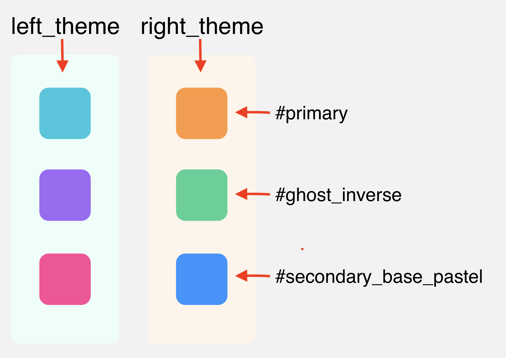

# motli-sketch-palette
A tool for creating [motli][1] palette from sketch files.

## How to run
You only need to provide two arguments (order matters):
1. Path to a specially formed sketch file with a color palette;
2. Path to a file where parsed palette will be stored (for further using with [motli][1]).

For example:

```sh
java -jar motli-sketch-palette.jar /Users/test/palett.sketch /Users/test/palette.json
```

## Hot to create a palette
First of all take a look to the sample palette built with Sketch:



There are two themes left and right with 3 colors each. 

Theme is represented with the vertical rectangle. The name of the rectangle MUST ends with "_theme" suffix (without quotes). 
In the example above left theme is called "left_theme" and right theme - "right_theme".

Color within theme is represented with the rectangle placed RIGHT INSIDE theme rectangle. The name of the rectangle MUST 
be written in [snake-case](https://en.wikipedia.org/wiki/Snake_case) and starts with hashtag sign. [motli][1] will
transform color names to [lowerCamelCase](https://en.wikipedia.org/wiki/Camel_case) later.

You may find [test-palette.sketch](src/test/resources/test-palette.sketch) file with palette described above.

## How it works
*motli-sketch-palette* tries to find shapes with names ending with "_theme" and considers them as theme-shapes. Then 
tries to find shapes that placed completely inside theme-shapes and considers them as colors of corresponding theme.

## License
Copyright (c) 2019 Mail.Ru IM

Licensed under the [MIT](LICENSE) License. 

[1]: https://github.com/mail-ru-im/motli